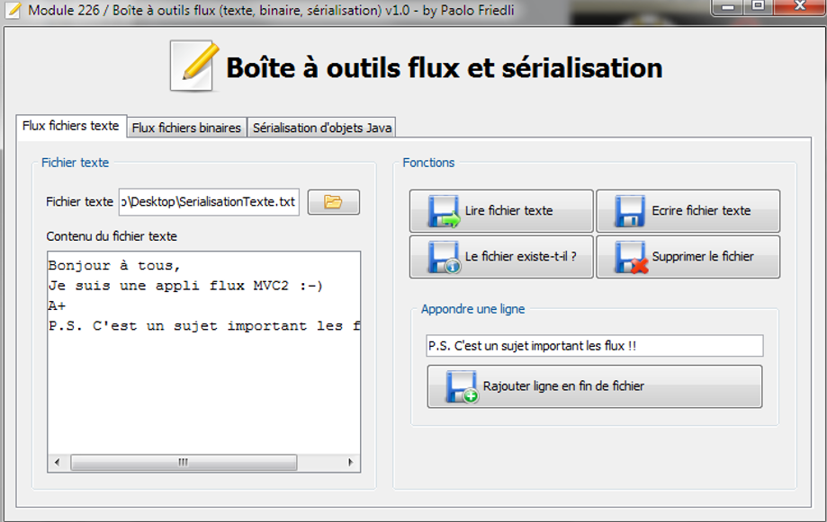

# ToolkitBase - Flux

## Introduction
Le projet `FluxToolkitBase` est un exercice qui vous permettra de progressivement réaliser votre 
« caisse à outils » de fonctionnalités autour de l’utilisation :
- des flux texte (avec la lecture, l’écriture et le rajout de texte dans des fichiers)
- des flux binaires (avec la lecture et l’écriture de types de base Java dans des fichiers)
- de la sérialisation et désérialisation de tous types d’objets Java
 
Le projet qui vous est donné est complet ð toutes les classes sont déclarées ainsi toutes leurs méthodes. Elles sont toutes implémentées mis à part celles concernées par cet exercice.
Trois workers spécialisés (`WrkTextFile`, `WrkDataFile` et `WrkObjectFile`) renferment ces quelques méthodes à implémenter.
 
## Interface utilisateur
L’ihm est composée de 3 onglets permettant d’accéder à des fonctionnalités propres aux 3 domaines de fonctionnalités précitées.
Le premier onglet permet d’expérimenter les fonctionnalités autour de la lecture, l’écriture et le rajout de texte dans des fichiers.

Le second onglet permet d’expérimenter les fonctionnalités autour de la lecture et l’écriture de types de base Java dans des fichiers. Dans cet exemple, c’est un dessin monochrome qui sera sauvegardé (un tableau à 2 dimensions de booléens représentant chaque point du dessin).

Et pour terminer le troisième et dernier onglet permet d’expérimenter les fonctionnalités autour de la sérialisation et désérialisation de divers objets Java.

## Fonctionnement
Le fonctionnement de l’application est simple et sera démontré par le prof 
(=pas décrit en détail ici).
Attention : à sa fermeture, l’application sérialise son état et à son démarrage, elle tente de désérialiser son état.
 
## Travail à réaliser
- Implémentez méticuleusement les méthodes des workers spécialisés
- Testez soigneusement l’application afin de vérifier que son comportement soit bien celui souhaité 
- Produisez le diagramme UML de l’ensemble des classes de l’application 
- Produisez le diagramme UML des workers de l’application 
- Produisez le diagramme de séquence de la méthode main()
- Suivez toute la chaîne des appels de méthode en partant du bouton « Ecrire un String » de l’ihm